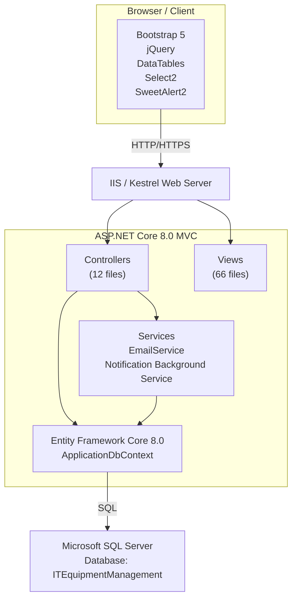

# IT Equipment Management System

> A comprehensive ASP.NET Core MVC solution for managing IT equipment, components, maintenance, repairs, inventory, and full asset lifecycle operations.

👉 <a href="https://www.ahitec.com/p/phan-mem-quan-ly-thiet-bi-it.html" target="_blank">https://www.ahitec.com/p/phan-mem-quan-ly-thiet-bi-it.html</a>

## Overview

**IT Equipment Management** is a comprehensive IT equipment and component management system built on **ASP.NET Core 8.0 MVC**. The system helps organizations track and manage the complete equipment lifecycle, from stock intake and deployment to maintenance, repair, and disposal.

## Technical Stack

| Component | Technology |
| --- | --- |
| Backend | ASP.NET Core 8.0 MVC |
| ORM | Entity Framework Core 8.0 |
| Database | Microsoft SQL Server |
| Authentication | Cookie-based authentication with BCrypt password hashing |
| Frontend | Bootstrap 5.3.2, jQuery 3.7.1, DataTables 1.13.7 |
| UI Components | Select2 4.1.0, SweetAlert2, Bootstrap Icons |
| Email | MailKit via SMTP |
| QR Code | qrcodejs |

## User Roles and Permissions

| Role | Permissions |
| --- | --- |
| **Admin** | Full access: user management, system configuration, CRUD operations across all modules, and data deletion |
| **User** | Business operations: create and update maintenance records, repair records, stock-in/stock-out transactions, and inspection checklists |

## System Architecture

## Key Features

1. **Complete equipment lifecycle management** — Track assets from stock intake to deployment, maintenance, repair, and disposal.
2. **Dynamic attributes** — Define custom attributes for each equipment or component type.
3. **Automated maintenance planning** — Generate maintenance schedules based on configurable frequencies, such as monthly, quarterly, or yearly cycles.
4. **Email notification system** — Automatically notify users when maintenance tasks are approaching due dates or are overdue.
5. **Inspection checklists** — Generate equipment-specific checklists based on equipment type.
6. **Component inventory management** — Manage stock-in and stock-out transactions, monitor inventory levels, and receive low-stock alerts.
7. **Equipment label printing** — Print QR code labels compatible with Brother label printers using a 24 x 40 mm label size.
8. **Comprehensive reporting** — Generate reports for equipment, components, stock movements, inventory balance, and asset disposal.
9. **Responsive user interface** — Optimized for both desktop and mobile devices.
